<!--
# Style lead only for this slide
_class: lead
_footer: Algorithmique Avancée et Bibliothèque Graphique - 2022-2023
-->


**ING1** Projet d'informatique


# ECE World

Equipe 2 Groupe 11

---

# Equipe 2


- Elias Elabd
- Nicolas Chaudemanche
- Alex Huang
- Rayan Malki 

---

# ECE World

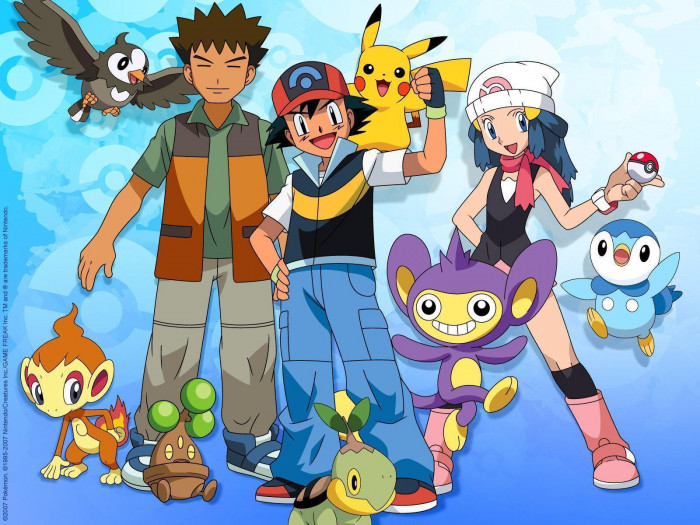

## Thème

Nous avons choisi comme thème pokémon, avec une carte issue de **Pokémon: Diamant et Perle**, parfaite à nos yeux par ses nombreuses maisons, que nous avons utilisé comme entrées aux jeux implémentés. 

---

# Sommaire 

1. La Carte du jeu

2. Le Projet 

3. Les jeux de chacun

4. Utilisation de GitHub, améliorations possibles

5. Bilan 
---

# Carte 
*Réalisée par : **Elias***

La carte comporte certaines fonctionnalités telles que: 
- Une image de sprites unique, optimale pour la mémoire
- Implémentation d'une touche de sprint (E)
- Des collisions sur bordure blanche pour s'assurer que le joueur ne sorte pas de la carte de jeu
- Une sortie de la carte **In Game** avec une animation
- Système de tour par tour dans le choix des jeux 
- Actualisation du sprite en fonction du joueur

---


# Projet/Organisation des jeux

Nous avons **optimisé** au maximum le code, tous les jeux sont des sous-programmes appelés dans le **main**, sous-programmes se trouvant dans un fichier **Fonctions.c** et leur prototypes dans un fichier **Fonctions.h**. De facon générale, notre **main.c** ressemble à:
```C
int main()
{
    initialisationJoueur(parametre);
    while(notWin)
    {
        deplacement_personnage(a, b, c);
        guitar_hero(a, b, c);
        paris_equestre(a, b, c);
    }
    ...
}
```
---

Chaque sous-programme "principal" prend en au minimum en paramètre la **structure joueur** et le **buffer**. 
```C
typedef struct{
    BITMAP* haut[3];
    BITMAP* bas[3];
    BITMAP* gauche[3];
    BITMAP* droite[3];
    int x, y;
    int direction;
    int instant;
    int deplacement;
    char nom[20];
    int nb_tickets;
    int bet;
}personnage;
``` 
---
Ces sous-programmes principaux contiennent également multiples sous-programmes uniques à chaque jeux. Chaque sous-programme principal commence par une condition de position sur la carte afin de lancer le jeu: 
```c
if(joueur.position ∈[Intervale X et Y] && key[KEY_ENTER] && joueur.nb_tickets > 0);
```
S'enchaînent ensuite les sous-programmes de jeu, par exemple: 
```c
guitar_hero(a, b, c, d)
{
    charger_musique(e, f, g);
    defiler_fond(h, i, j)
    verification_note(k, l, m);
}
```
Chaque jeu se termine automatiquement après que chacun aie joué et que le jeu en lui même soit fini. On retourne ensuite sur la map et c'est à l'autre joueur de jouer. 

---


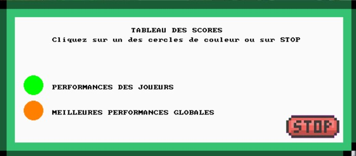

Pour ce qui est de la sauvegarde, une partie de la carte y est dediée, donc accessible **InGame**. C'est un système qui marche avec la création d'un **fichier de sauvegarde** auquel on accède pour retrouver nos informations. 

---
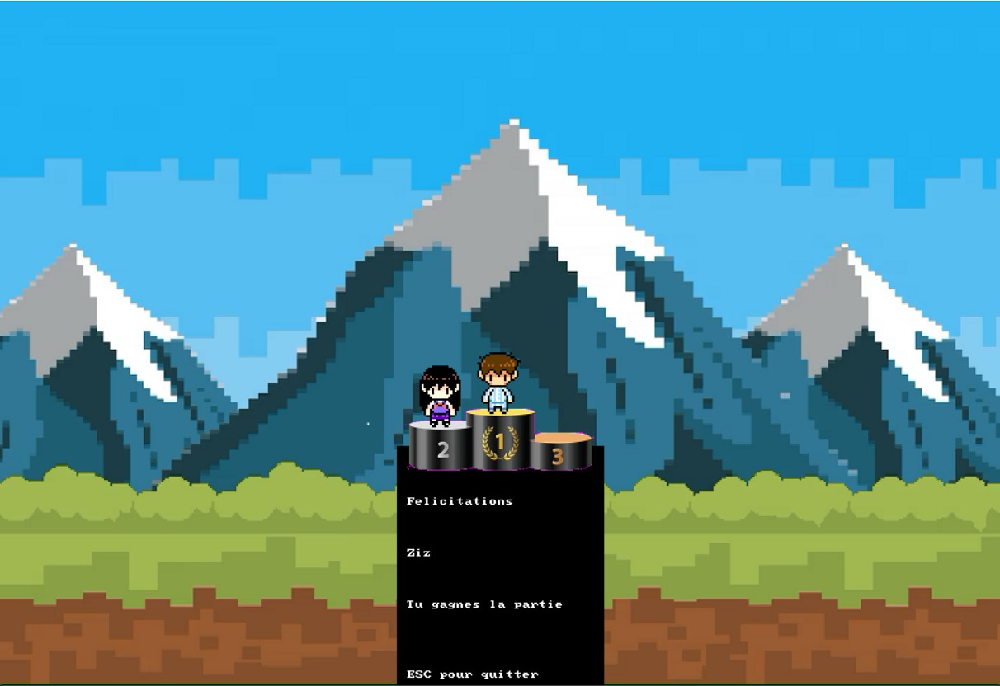
# Classement et fin de partie

Pour ce qui est de la fin de partie, une fois que le nombre de ticket est égal à 0 pour un des deux joueurs, la condition de **while(notWin)** se remplit et la partie prend fin, on affiche le classement. Finalement on a :
```c
int main()
{
    ...
    while(notWin)
    {
        ...
    }
    animationClassementFinPartie(a, b ,c ,d);
    destroy_bitmap(x);
    return 0;
}END_OF_MAIN;
```


---


# Guitar Hero 
Réalisé par : **Elias** 
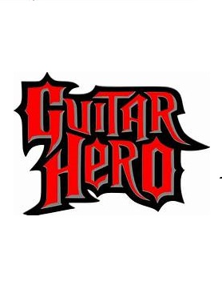 

- Charger la musique, la carte, et la faire défiler
- Lancer la partie, la musique et le timer
- Détection des touches (jeu)
- Le joueur qui tient le plus longtemps gagne la partie 

---
# Fonctions utilisées

```c
void guitar_hero(personnage joueur[2], int *b, BITMAP *buffer,
 BITMAP *ticket, const char *nom_fichier_perf, const char *nom_fichier_perf_ot);
SAMPLE *charger_musique(const char *nom);
void defiler_fond(BITMAP *buffer, BITMAP *fond,int decalage);
void attendre(clock_t debut, double delai);
int verification_note(BITMAP *buffer, BITMAP *fond, int note, int decalage);
int verification_passage(BITMAP *buffer);
void remplir_pixel_en_blanc(BITMAP *fond, int x, int y);
void changer_couleur_pixel(BITMAP *fond, int x, int y);
```

---

# Graphe d'appel

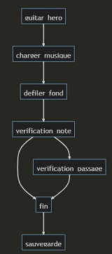

---

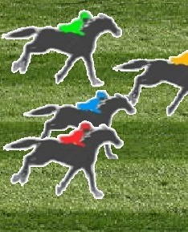

# Paris équestres
Réalisé par : **Nicolas**
- Charger les chevaux
- Parier sur un cheval gagnant 
- Prier pour que son cheval gagne
- Ecran de fin de partie qui indique qui a gagné et perdu  

---

# Fonctions utilisées

```c
void course_equestre(personnage *joueur, BITMAP *buffer, int i);
void refreshImageTest(t_chevaux *chevaux, BITMAP* buffer, BITMAP* decor, int c);
int jeuTest(t_chevaux  *cheval, BITMAP* buffer, BITMAP* piste, const int *tempon, const int *temponCheat);
void ParisEquestres(personnage *joueur, BITMAP *buffer, int *tempon,int *temponCheat, BITMAP *interfacePari);
void ResultatJeuxTest(t_chevaux *chevaux, BITMAP *buffer, BITMAP *piste, int *tempon, int *temponCheat,
 personnage joueur[2], BITMAP *winner);
```
# Structure utilisée
```c
typedef struct{
    int PositionX;
    int PositionY;
    BITMAP *tab[5];
    int vitesse;
    int winner;
}t_chevaux;
```
---
# Graphe d'appel

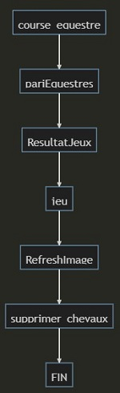

---

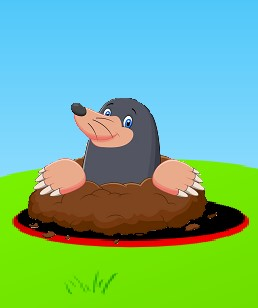

# Jeu de la taupe
Réalisé par : **Rayan**

- Les Taupes appraissent aléatoirement dans les trous 
- Animation faite sur le marteau
- Le jeu fonctionne avec un timer de 25 secondes
- Les taupes apparaissent respcitivement à des vitesses différentes 
---
# Fonction utilisée

```c
void jeu_taupe(personnage joueur[], int *c, BITMAP *buffer, BITMAP *fond, BITMAP *cursor, BITMAP *taupe);
``` 

# Structure utilisée

```c
typedef struct{
    int x, y;
}t_taupe;
``` 
---
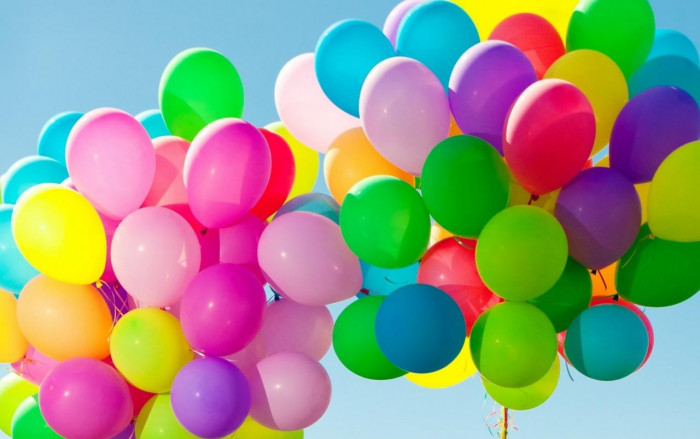
# Tir aux ballons
Réalisé par : **Alex**

- Chargement des BITMAPs
- Les ballons bougent aléatoirement 
- La vitesse des ballons est également aléatoire
- Le vainqueur est le premier à tirer sur tous les ballons 
- Les collisions sont détéctées    
---
# Fonctions utilisées

```c
void tir_ballon (personnage joueur_g[], int *b,
 BITMAP *page, BITMAP *viseur, BITMAP *ticket , ballon tab[NB_BALLONS],  const char *nom_fichier_perf, 
 const char *nom_fichier_perf_ot);
BITMAP* chargerImage (const char* nom_image);
void initBallon (ballon* B,int posxInit, int posyInit, int depxInit, int depyInit );
void affichierBallon (BITMAP* page,ballon* B);
void deplacementBallon (ballon *B);
void supp_ballon (ballon *B, int *score);
void resultat (personnage joueur [], int* i, const double* temps_execution, BITMAP *page, BITMAP* resultat_tir);
void affichierViseur (BITMAP* page, BITMAP* image);
``` 

# Structure utilisée
```c
typedef struct{
    BITMAP* img;
    int posx, posy;
    int depx, depy;
    int tx, ty;
    int boom;
}ballon;
``` 
---

# Graphe d'appel

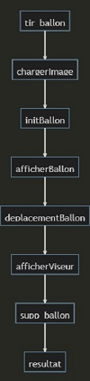

---
# Pêche aux canards 
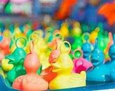
Réalisé par : **Rayan**

- Les canards ont des vitesses aléatoires
- Il y a au maximum 10 canards 
- Ils réapparaisent s'ils n'y a plus de canards 
- Si un canard n'est pas attrapé, il réapparait à gauche de l'écran 
---
# Fonctions utilisées

```c
int verifier_position(t_canard* canards, int nb_canards, int x, int y);
void initialiser_canard(t_canard canards[], int nb_canards, int id, BITMAP* sprite, int vitesse);
void mettre_a_jour_canard(t_canard* canard);
void dessiner_canard(t_canard* canard, BITMAP* buffer);
void pecher_canard(t_canard* canard, int* score);
void detruire_canard(t_canard* canard);
void afficher_intro() ;
void mise_a_jour_jeu(t_canard* canards, int* score, BITMAP* buffer, BITMAP* fond, int* chrono, time_t* temps);
int tous_les_canards_peches(t_canard canards[]);
void reinitialiser_canards(t_canard* canards, int* vitesse_actuelle, BITMAP *sprite);
void peche_canard(personnage joueur[], BITMAP* buffer);
``` 
# Structures utilisées
```c
typedef struct {
    int x;
    int y;
    int vitesse;
    int vivant;
    BITMAP* sprite;
} t_canard;
``` 
---
# Graphe d'appel
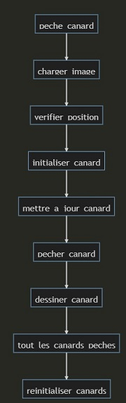

---
# Traversée de la rivière 
Réalisé par : **Elias**

- Chaque rondin est une entité différente grâce à une structure
- La détection du rondin se fait grâce à ses coordonnées et celles des pieds du joueur
- Ajout d'un sprint 
- Impossibilité de sortir de la carte quand on est sur le sol
- Chaque rondin à une vitesse propre à lui
- Le joueur perd s'il est emporté hors de l'écran

---
# Fonctions utilisées

```c
void traversee_riviere(personnage joueur_g[], int *b,  BITMAP*buffer, 
BITMAP *ticket, const char *nom_fichier_perf, const char *nom_fichier_perf_ot);
void initialisation_rondin(rondin *rd, BITMAP *rondin, int offset_x);
void afficher_rondin(rondin *rd, BITMAP *buffer);
void actualiser_rondin(rondin *rd);
void actualisation_personnage_traversee(personnage *perso, BITMAP *buffer);
int verification(personnage *perso, rondin *rd, BITMAP *buffer);
void victoire(BITMAP *buffer, personnage *joueur, double temps);
void defaite(BITMAP *buffer, personnage *joueur);
``` 
# Structure utilisée
```c
typedef struct{
    BITMAP *img;
    int x, y;
    int depx;
    int w, h;
}rondin;
``` 
---
# Graphe d'appel

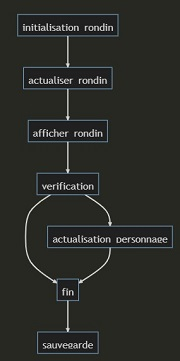

---
# Ping Pong

Réalisé par : **Alex**
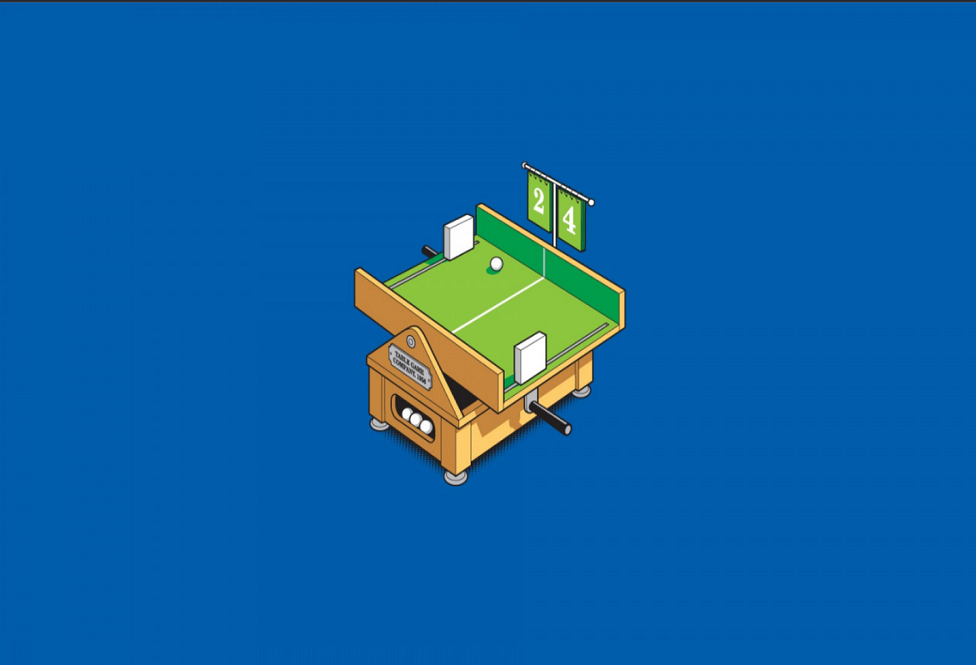
- Jeux de ping-pong **solo**
- Victoire donnée au joueur tenant le plus longtemps
- La balle **accelère** à chaque rebond contre le mur 
- Le jeu est entièrement basé sur des dessins de primitives de la bibliothèque Allegro
# Fonctions utilisées
```c
void pong (personnage joueur_g[], int *b, BITMAP *page, BITMAP *ticket, 
 const char *nom_fichier_perf, const char *nom_fichier_perf_ot);
```

---
# GitHub


Avec un total final d'environ 160 commits, **GitHub** aura sans aucun doute été la clé de la réussite de ce projet.  

---
# Bilan collectif
Nous pouvons d'abord commencer par dire que ce projet, contrairement au précedent, à été pour tout le monde bien plus amusant. Il a été amusant, mais par dessus tout nous à permis de renforcer considérablement nos capacités en C et même globalement nôtre logique algorithmique. De plus la découverte de GitHub est, pour nous futurs ingénieurs, la découverte d'un outil de travail exceptionnel, qui nous servira tout au long de nos vies professionnelles.

---

## Tâches réalisées 

- `✅  Réalisation de la carte: 100%` 
- `✅  Implémentation d'un jeu de chaque difficulté au minimum 100%` 
- `✅  Chaque membre du groupe à un jeu à lui 100%` 
- `✅  Le projet est fonctionnel 100%`
---


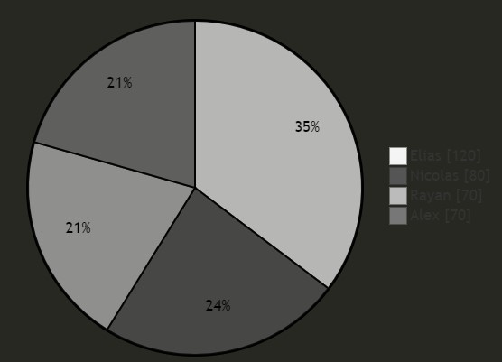

---

# Récapitulatif des jeux

| Jeu | Avancement | Problèmes / reste |
| --- | --- | --- |
| Pêche aux canards | 90% | - Les canards vont trop vite et problèmes de clics|
| Tir aux ballons | 95% | - Crash parfois |
| Guitar Hero | 95% | - Parfois, problème de synchronisation avec la musique |
| Course équestre | 95% | - Le cheat, si appliqué sur un cheval sur lequel l'autre joueur a déjà parié, ne fonctionne pas | 
| Traversée rivière | 100% | Aucun | 
| Jeu de la taupe | 90% | - Problèmes de clics | 
| Ping Pong | 95% | - L'accéleration de la balle est trop rapide| 


---
